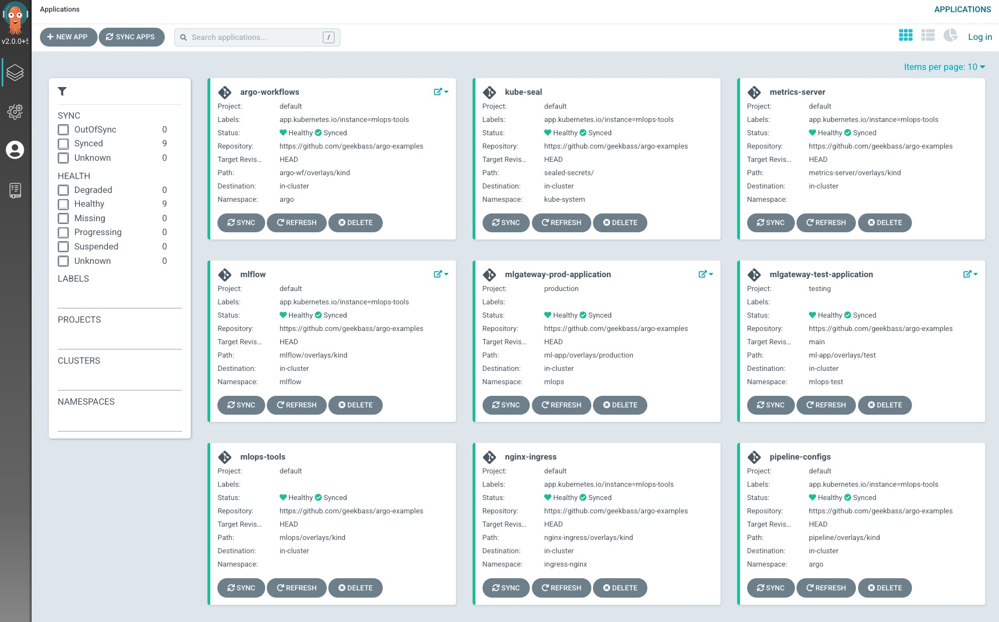
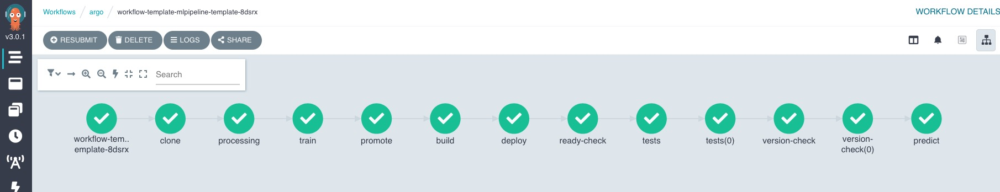
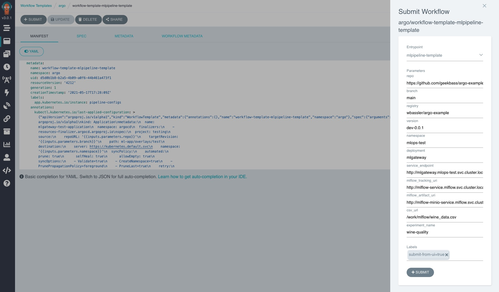

# Argo Workflow and ArgoCD Example
The following is an example of using [MLFlow](https://mlflow.org/) (for experimentation tracking and model registry), [Argo Workflows](https://argoproj.github.io/argo-workflows/) (for ML pipelines for building and testing ML apps), and [Argo CD](https://argoproj.github.io/argo-cd/)
(for a GitOps approach for managing our Apps) running on Kubernetes. It uses an example ML App in Flask to serve an example ML model and utilizes several tasks in a Dag as examples of specific tasks that you might do in an MLPipeline. It is also worth noting that we are using Kustomize for initial install of Argo CD and also for Argo CD to manage our apps. A bash script has been provided to make initial setup of the cluster automated.

This creates a Kind cluster locally with local volumes attached for persistence and deploys the following components using ArgoCD App of Apps (`mlops/overlays/kind`): MLFlow (with PGSQL backend and Minio artifacts), ArgoCD (GitOps), Argo Workflows (Pipelines), Nginx Ingress (Ingress and basic auth), Metrics Server (HPA), Kubeseal (secret seal), and Pipeline configuration for Argo Workflow. Anytime you make changes to any of these components you can simply wait a few minutes or manually sync the `mlops-tools` application in Argo CD.

**You may use this repo as a template and for testing locally on your own and is adjusted to be used for such. Please do not use this in production but for local testing and demos.**

The current setup assumes/creates a "Production" ML app managed by Argo CD. This will get updated automatically by staying in sync with main branch. A test environment will be built and deployed with Argo Workflow.

*NOTE: All parameters in the Pipeline file should be adjusted accordingly to fit your needs. If you fork this repo you will need to either modify the default parameter values for repo and registry in the workflow template (`pipeline/base/pipeline-workflow-template.yaml`) or simply change them each time you run the workflow template.*





Phases:
1) [x] Get an example build/deploy pipeline setup

2) [x] Add tests to the pipeline (Examples not real)

3) [x] Add MLflow 

4) [ ] Add Jupyter Notebooks for experimentation


## Prereqs
 - [Kind](https://kind.sigs.k8s.io/)

 - [Docker](https://www.docker.com/)

 - [DockerHub access Token](https://docs.docker.com/docker-hub/access-tokens/)

 - [Kubectl CLI](https://kubernetes.io/docs/tasks/tools/#kubectl)

 - [Kubeseal CLI](https://github.com/bitnami-labs/sealed-secrets)

 - [Kustomize CLI](https://kustomize.io)

## Example App Overview
For our example we have taken the Wine Quality example from MLFlow [tutorials](https://www.mlflow.org/docs/latest/tutorials-and-examples/tutorial.html) to train a linear regression model using scikit-learn. The point of this example is to have a model that is capable of making a prediction of the "Quality" of a wine on a scale of 0-10 when given a specific set of data. We serve our model in Flask using the MLFlow Model Registry at the endpoint [`http://localhost/predict`](http://localhost/predict). For more information on the "Wine Quality" model example please visit the [Wine Quality example data set from UCI](http://archive.ics.uci.edu/ml/datasets/Wine+Quality).

An example request looks like:
``` 
curl --request POST --header "Content-Type: application/json" --data \
'{"fixed_acidity": 4.2, "volatile_acidity": 0.37, "citric_acid": 0.63, "residual_sugar": 9.7, "chlorides": 0.606, "free_sulfur_dioxide": 62, "total_sulfur_dioxide": 276, "density": 0.997, "ph": 3.73, "sulfates": 1.45, "alcohol": 12.9}' \
http://localhost/predict 

```

## Getting Started
Ensure that you have all the prereqs listed above. A simple bash script has been provided to assist with complete initial setup.

1) Export variables for `$DOCKER_USERNAME` and `$DOCKER_TOKEN` after you create your [DH access tokens](https://docs.docker.com/docker-hub/access-tokens/). This will give permissions to create a registry and new tag with each pipeline run. *NOTE: the script creates the secret with kubseal so that we do not accidentally push a secrets file that can be decoded to a public repo. Although we do not commit this kubeseal file either, you can do this yourself if you so desire. For more information on Kubeseal see their documentation.*
```
export DOCKER_USERNAME=username
export DOCKER_TOKEN=yourtoken1234
```

2) Run the bash script. This will take some time to complete.
```
bash deploy-k8s.sh
```

3) Create the following entries in your `/etc/hosts` file. This will allow you to use your favorite browser to visit the UI of each component. 
```
127.0.0.1 argo
127.0.0.1 argocd
127.0.0.1 tests
127.0.0.1 mlflow
127.0.0.1 minio
```

When finished you can visit the following links:

- [ArgoCD](http://argocd/applications): admin/password
- [Argo Workflows](https://argo/argo/workflows/): admin/password
- [MLFLow](http://mlflow/#/): admin/password
- [Minio](http://minio): minio/minio123

## Overview of Current Pipeline Flow
The following steps are used when we need to run a new version of the example ML App. It is an example process that kicks off the example ML Pipeline.

1) Pull the repo and create a new branch.
``` 
git clone git@github.com:geekbass/argo-examples.git 
git checkout -b new_branch
```

2) Make changes to your A) code (`app.py`) such as the `VERSION` and B) modify the image `NewTag` in `ml-app/base/kustomization.yaml` file. Note: that if you forked this repo you will modify the image and the tag for the app in order to publish and pull an image from your own Docker registry.

3) Commit your changes and create a PR against the main branch.
```
git commit -m 'new version' -i app.py ml-app/base/kustomization.yaml
git push origin new_branch
```

4) Submit the [workflow template created](https://argo/argo/workflow-templates/). Modifying the parameters for branch and version. Branch should be set to the new branch you just created and `VERSION` is the updated version tag you are creating. *NOTE: If you forked this repo you may also need to modify the registry and the repo values if you did not set new defaults*



5) Once all tasks complete as successful in the workflow template, Merge the PR to main branch. If it fails you may hit "re-submit" to retry the pipeline from the failed task.


*Step 5 will deploy the changes to your Production Application in Argo CD. You may either kick off the sync immediately or wait a couple of minutes as auto-sync is currently enabled.*


### Pipeline Steps explained
As mentioned, this is strictly used as an example and the code is not at all real. We simply use Python code to perform our example tasks but should be noted that this could be anything that fits your needs. You may read the comments in the code and/or the code in `./mlflow/` directory for more information.

1) Clone - This task clones the repo at the specified branch and puts it on a persistent volume to be accessed in other tasks.

2) Processing - Acts as a data processing step where random data is created for training.

3) Train - Trains our model and registers it to MLFLow. You can see the created experiment for this [example here](http://mlflow/#/experiments/1).

4) Promote - Promote the previous model to "Production" stage so that we can serve it via Model Registry. You can view the registered models created [above here](http://mlflow/#/models/wine-model).

5) Build - Builds a docker image and pushes it to Docker Hub. In this case we use a Flask app that will serve our model.

6) Deploy - Deploys a "Test" stack of our application by creating it in ArgoCD. This is based on the branch we create for our PR.

7) Ready Check - A simple check to ensure that the pods of our "Test" stack are ready and not failing.

8) Tests - Used as an example test scenario. We send a JSON request with fixed data to our prediction endpoint to get a 200 response. This would likely be better served as a unit test in a real world scenario. 

9) Version Check - Checks the version of our app to ensure the new one is deployed.

10) Predict - Send a randomly generated JSON request to our predict endpoint to see if we get a valid prediction.